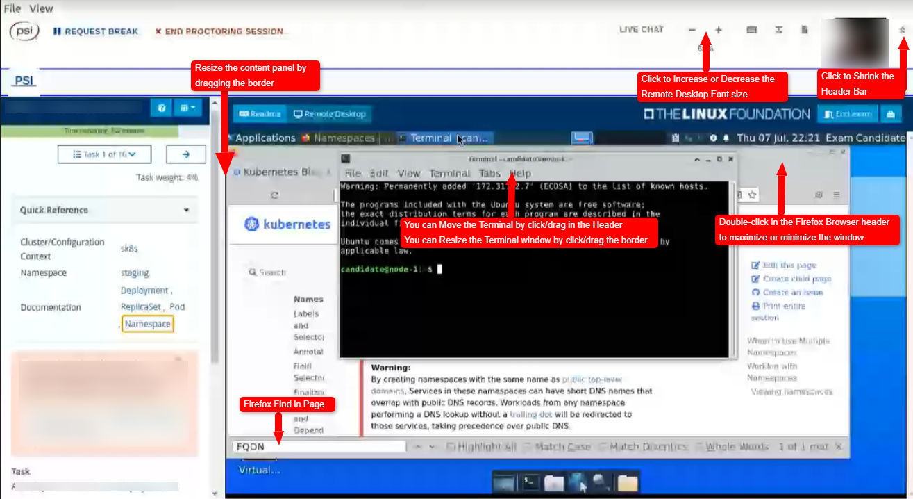

## Introduction

Mon score : 92% au (presque) premier essai.

J'ai beaucoup travaillé et révisé pour réussir cette certification. Je ne reviendrais pas sur l'aspect préparation à l'examen en lui même, il y a déjà beaucoup de ressources et de conseils avisés sur internet que je vous conseille de suivre. Mais en résumé, une solide base :
- Connaître les notions Kubernetes au programme (obviously)
- Très bien maîtriser kubectl
- Soit vous tapez vite, soit vous savez créer des alias pour compenser
- Savoir utiliser VIM correctement
- Etre capable de copier/coller rapidement dans un environnement de bureau à distance avec un terminal linux

De mon côté, j'ai malheureusement négligé une partie qui, j'allais m'en rendre compte, est très importante dans un examen en remote. La machine, et la phase de check-in🙂.

## Le "check-in"

C'est l'entretien préalable à l'examen.

Il vous est conseillé de vous connecter 30 minutes avant l'heure réelle de l'examen. Il vaut mieux s'y tenir, la phase de check-in peut être vraiment longue. Je suppose que les examinateurs gèrent plusieurs candidats à la fois, en réalité cette phase peut facilement prendre plus d'une heure.

Il faut comprendre le créneau qui vous est réservé comme un créneau "d'entrée". Si votre examen est planifié de 10h à 12h, comprenez que vous avez de 9h30 à 12h pour entrer dans l'examen. Mais vous pouvez tout aussi bien patienter une bonne heure dans la phase de check-in, avant d'avoir accès à la première question.

Soyez prêt à patienter donc, et ne venez pas en retard 😃.

Pendant cette phase :
- Vous allez pouvoir télécharger le binaire du bridge.
  Impossible de l'avoir avant, il est spécifique à votre examen et à votre créneau.
  Il est donc également impossible de vérifier à l'avance qu'il va bien fonctionner, vous l'avez compris...
- L'application va lancer un check de votre PC.
  Il vous demandera d'arrêter un certain nombre de services (hyper-v, one drive, notepad, chrome, gestionnaire des tâches, et plusieurs autres services). A cette étape, si vous n'êtes pas administrateur de votre poste, c'est mort :).
- Puis il vous sera demandé de prendre une photo de votre carte d'identité, ainsi qu'un selfie pour l'examinateur compare les deux clichés
- Patienter, longtemps, que l'examinateur vérifie vos documents.
- Une fois la phase de vérification terminée, une fenêtre pop-up apparaîtra et vous serez alors en relation avec l'examinateur par chat textuel, en anglais.
  Pendant cette phase, il vous demandera éventuellement de reprendre en photo votre carte d'identité, si elle floue ou s'il n'arrive pas à vous identifier, puis vous demandera de scanner la pièce dans laquelle vous vous trouvez à l'aide de la webcam, du sol au plafond, puis le bureau sur lequel vous allez passer l'examen (sous le clavier, sous le laptop, etc...)
- Une fois identifié, l'examen démarre, la popup se ferme, et l'interface de l'examen apparaît.

Méfiez vous des retours sur internet, surtout regardez bien la date : il y a eu du changement depuis l'été 2022 sur la plate-forme, certains retours sont désormais partiellement faux. Par exemple, en cherchant un peu, vous allez tomber sur des blogs vous expliquant qu'il est possible d'utiliser plusieurs écrans, d'avoir la documentation d'un côté et le terminal de l'autre... Et non🙂 Plus maintenant !

Pour ma part, ma première phase de check-in a été un échec. Je vous partage ci-dessous mon expérience, si d'aventure elle peut vous éviter de tomber dans les mêmes pièges, j'en serais ravi...

---

Je me connecte donc 30 min avant le début, comme recommandé.
Je télécharge le binaire, je l'installe... Erreur technique, impossible de le lancer. J'apprendrais plus tard que l'outil ne fonctionne pas sous Ubuntu (alors que le test de validation me disait que tout était ok). Un comble pour un examen proposé par la Linux Foundation.

Je me précipite en catastrophe vers mon autre laptop, sous Windows 10, le binaire se lance. J'arrive à lancer le check-in, je dois prendre une photo de ma carte d'identité et un selfie pour confirmer que c'est bien moi... Et après 15 minutes d'attente, le surveillant m'informe qu'il n'arrive pas à reconnaître ma tête, la photo de ma carte d'identité est floue. Ma foi, c'est une webcam de laptop, il n'y a pas d'auto-focus, pas trop choquant 😕. Bref, j'insiste, j'essaie de prendre une autre photo, j'y arrive péniblement... Le surveillant me répond une fois toutes les 5 minutes, et 30 minutes plus tard on m'explique que de leur côté ma webcam a freeze, ils n'arrivent plus à me voir et me recommandent de redémarrer le bridge.

A ce moment, cela fait déjà 45 minutes que je suis connecté.

Je redémarre le bridge, et cette fois, de 10h15 à 11h30, plus aucun évaluateur ne prendra ma demande de check-in, je finirais par me faire éjecter de l'évaluation et ne pourrais plus y revenir, le délais étant dépassé.

Je suis effondré, j'essaie de contacter le support de PSI et de Linux Foundation, les premiers m'expliquent que cela doit venir de mon PC ou de ma connexion (mon pc va très bien, et j'ai la fibre 2Gb...). Les deuxièmes sont sous l'eau et préviennent qu'ils ne sont pas capables de répondre en dessous de 5 jours ouvrés.

Après plusieurs jours, Linux Fondation me répond de façon très compréhensive, réinitialise la page me permettant de m'inscrire à l'examen, et j'ai pu immédiatement le replanifier... Au deuxième essai il m'a été possible de rentrer, cette fois j'étais prêt, non seulement à passer l'examen, mais également à passer le check-in.

## L'interface

Aller, le plus dur est fait🙂

Une fois l'examen démarré, voici ce que vous allez avoir à l'écran :

Vous allez donc travailler au travers d'un "bridge" (pas votre navigateur, c'est une application spécifique) avec :
- A gauche : les questions, des liens vers la documentation kubernetes, le numéro de la question et son poids.
- A droite : le bureau à distance vers une machine Ubuntu, sur laquelle vous pouvez lancer le terminal et un navigateur firefox.

Le comportement est similaire à celui que vous avez pu observer sur killer.sh ou autre plate-forme du même type (au niveau du copier/coller, du ressenti, etc...)

A chaque question, un gros encart rouge (celui que l'on perçoit en flou sur la capture d'écran) vous rappel que vous devez vous positionner dans un certain contexte, et vous donne la commande a exécuter pour vous y placer. Soyez rigoureux, faites le systématiquement. Ce serait bête d'avoir 0 à une question à laquelle vous auriez correctement répondu...

A tout moment pendant l'examen, le bridge capture votre webcam et le son de votre micro. Assurez-vous d'avoir une connexion capable de tenir la charge, sans quoi l'examinateur mettra fin à la session.

Il est recommandé dans la documentation officielle un écran 15", je dirais que c'est un bon minimum. Si vous prévoyez de passer la certification sur l'écran 13" d'un laptop, attendez vous à ce que l'expérience soit inconfortable.

## Le contenu

Evidemment je ne peux pas vous donner le contenu exact des questions. Par contre, comme on vous l'annonce killer.sh, elles sont d'un niveau similaire au simulateur, en un un peu moins complexe. Les deux séances offertes avec la certification m'ont vraiment aidé à me préparer à l'examen, que ce soit en terme de contenu ou d'expérience.

Pour se faire une idée, sur les deux séances killer.sh offertes, j'ai eu 67% à la première tentative et 98% à la deuxième.
Les questions sont toujours les mêmes, donc le score ne veut pas dire grand chose.
Par contre entre les deux essais, c'est ma vitesse d'exécution qui a changé : à la première tentative, je n'avais pas vraiment conscience du rythme qu'il fallait s'imposer.

Si les questions sont un peu moins difficiles dans l'examen par rapport au simulateur, elles sont également moins nombreuses. Vous avez plus de temps pour les réaliser, mais l'erreur est un peu plus punitive.

Les questions simples se réalisent avec une commande ou deux, les questions complexes nécessitent plus de réflexion et de travail.

Les points sont attribués de façon binaires :
- Votre déploiement correspond à l'attendu, vous avez 100% à la question
- Le déploiement ne correspond pas : 0%.

Donc les questions complexes le sont souvent parce que, nécessitant plus de travail, vous avez plus de risque de répondre à côté sur un point de détail. Et comme vous n'avez pas de bouton pour contrôler si vous avez répondu OK ou non, la seule façon de vérifier, c'est de le faire vous-même.

Quelques exemples de questions "complexes" que j'ai eu à traiter pendant l'examen :
- Réaliser un déploiement canary (les explications sont fournis dans l'énoncé)
- Corriger un déploiement HS
- Appliquer des Network Policies existantes à des pods pour obtenir le filtrage demandé
- Corriger le déploiement d'un pod et l'exposer à l'aide d'un nouveau service
- Créer et planifier un CronJob

Après l'examen, vous n'aurez pas le détail des questions sur lesquelles vous avez échoué. Pour ma part, je pense avoir raté la question sur les CronJob (qui comptait pour 8% de la note totale). Mon principal point de blocage a été de me souvenir de la chaîne cron correspondant à "une exécution toutes les 5 minutes"🙂. Et oui, on n'a accès qu'à la doc kubernetes officielles, pas autre chose !

## Conclusion

Si je devais résumer, en plus des autres recommandations habituelles, j'y joindrais ces quelques conseils pratico-pratiques :

- Venez à l'heure, avec un PC perso propre sous Windows ou MacOS (a priori c'est ok sous MacOS, mais je n'ai pas tenté🙂).
- Achetez ou empruntez une webcam de bonne qualité, qui soit capable de prendre une photo claire d'une carte d'identité et que le texte soit bien lisible, pas flou !
- Prévoyez une pièce propre, avec un bureau vide, un seul écran, et rien qui traine autour de vous.
  Je n'ai pas été embêté sur l'encombrement de la pièce, mais certains retours font état d'examinateurs un peu zélé de ce côté là...
- Ayez une connexion performante et stable, quitte à aller chez quelqu'un d'autre pour l'examen.

Avec une bonne préparation technique, j'ai terminé les questions à 15 minutes de la fin de l'examen, et ai pu me consacrer au re-check et à la correction de quelques imperfections. Donc techniquement il n'y a rien d'insurmontable.

Si vous vous apprêtez à passer la certification, il me reste à vous souhaiter bon courage, j'espère que mon retour aura pu vous être utile !